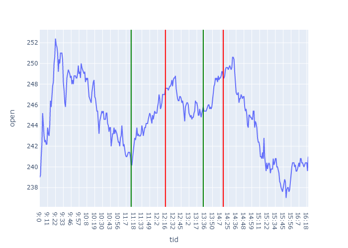

# Intradag
Her kan vi finne ut av ting.  
Her er et eksempel på hvor langt jeg har kommet. Jeg har funnet ut hvor det har gått bra. :) 
Målet blir da å klare å lage en modell som hermer etter det.

Olem:
<ul>
	<li> Last ned git bash
	<li> få tilgang på repo
	<li> leke oss litt med push, commit og pull
</ul>
La oss se hva vi kan gjøre
  
Commands i terminalen:
<ul>
	<li> pull: git pull
	<li> commit: git commit -m "beskjed"
	<li> push: git push -u origin master
</ul>
Finner ut hvordan man pusher/lager branches 
Klone repoet: 
Finn mappen du vil bruke 
`git clone git@github.com:stianteien/instradag.git`
Helt ny oppdatering 
Enda mer oppdatering