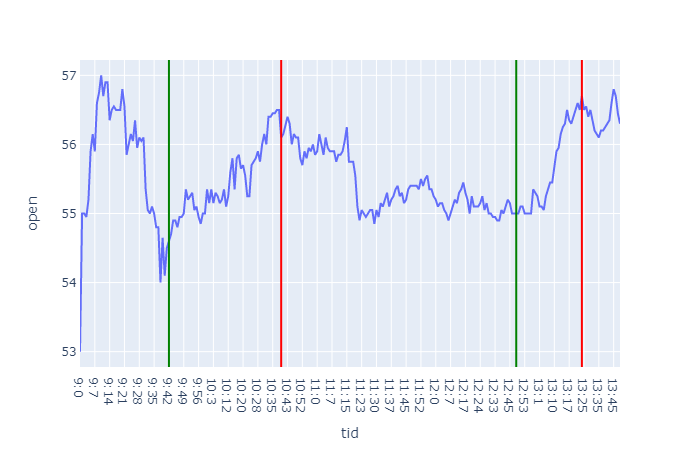

# History
I denne filen kan man skrive historie/logg hvis man har lyst. Bilder er kult.

### [24.08.2020]
Sett over 10 filer/dager og hentet ut 7 gode oppganger. Hentet ut fire indaktorer: rsi, trix, adxr og kdjk. 
Her er resultatet og mønsteret fra dem. Trix er den eneste som har et øyeblikket gjenkjennelig mønster.

### [20.08.2020]
Lagd fine grafer som gir en bilde av når oppgangen starter og slutter. Grønn er start, rød er slutt.

### [19.08.2020]
Nå har jeg funnet ut en grei måte å få til å se når det er positiv vekst i grafen. 
Basert på den akumelerte scoren av positiv utvikling og prosentvis oppgang kan jeg se hvilke oppganger jeg har lyst til å ta vare på 
Neste mål blir å koble indikatorer til oppgangene

### [06.08.2020]
Start project. Lastet opp fra colab og organisert.