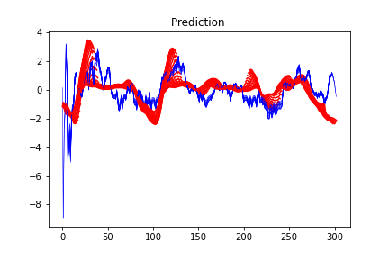

# History
I denne filen kan man skrive historie/logg hvis man har lyst. Bilder er kult.

### [19.09.2020]
Funnet ut hvordan man kan bruke se fremover flere enn ett skritt. Nå ser jeg fremover 15 skritt basert på  
de 30 bak. Da gir det en kurve som har ser ganske grei ut med tanke på at det kan være mye feil.
 

### [18.09.2020]
Funnet ut hvordan jeg kan ha flere feauters (x) inn i det trente nettverket.  
Trente på en runde og fikk ganske godt resultat når jeg kjørte prediksjonen på andre testsett. 
  

### [18.09.2020]
Normalisert ydata for å få en spredning som er lettere å lære for RNN.  
Trener på den deriverte 30sma for å standardisere prisvekst.  
 

### [16.09.2020]
Jeg er ikke helt overbevist over standardavvik-tilnærming, så tester jeg ut maskinlæringsmodeller.  
Først tester jeg RNN med LSTM. Her tester jeg og trene på samme datasett bare for å vise at det kan funke.  
Det andre bildet er kun basert på RSI. Gir noe utslag i slutten som er bra.  
 
 

### [30.08.2020]
Satt sammen første trade plot basert på modellen. Oppgangen er der den vil holde posisjon og ned er der den vil være ute. 
Det var sånn passe vellykket. Det virker som den ikke helt vil legge inn posisjon i oppganene men kun når det er flatt.. 
 

### [28.08.2020]
Funnet mean og stdv for hver oppgang på de forskjellige indikatorene. Dataframenen ser fint ut: 
 
Her er trix med stdv for å avgrense hvor man kan ligge innenfor. Nå regnes det med 2 stdv for å få ca. 95% av innenfor. 
Kan se om jeg finner noen statistikktabeller for å finne ut av nøyaktig z*. 
 

### [26.08.2020]
Skyter litt i blinde for å se etter gode indikatorer, så ønsker å prøve å lage en modell basert på det som ser bra nok ut til nå. 
De som har gjort det bra er: trix, rsi, sma16-8 og macds. 
Neste mål blir å lage en modell ut av disse 

### [24.08.2020]
Sett over alle 80 filer/dager og hentet ut ca 35 gode løp med over 1 prosent stigning og score over 30. 
Tatt å hentet ut fem indikatorer: trix, rsi, adxr, kdjk og pdi for å se hva de har å by på. 
Resultatet og mønsteret ligger under. Kun trix har øyeblikkelig gjenkjennelig mønster. 

### [20.08.2020]
Lagd fine grafer som gir en bilde av når oppgangen starter og slutter. Grønn er start, rød er slutt.

### [19.08.2020]
Nå har jeg funnet ut en grei måte å få til å se når det er positiv vekst i grafen. 
Basert på den akumelerte scoren av positiv utvikling og prosentvis oppgang kan jeg se hvilke oppganger jeg har lyst til å ta vare på 
Neste mål blir å koble indikatorer til oppgangene. 

### [06.08.2020]
Start project. Lastet opp fra colab og organisert.