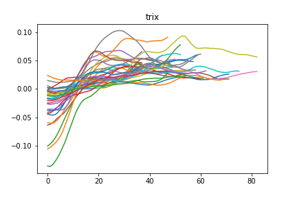
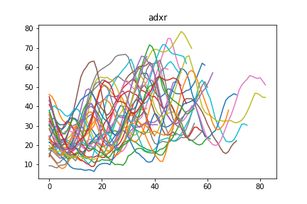

# History
I denne filen kan man skrive historie/logg hvis man har lyst. Bilder er kult.

### [24.08.2020]
Sett over alle 80 filer/dager og hentet ut ca 35 gode løp med over 1 prosent stigning og score over 30. 
Tatt å hentet ut fem indikatorer: trix, rsi, adxr, kdjk og pdi for å se hva de har å by på. 
Resultatet og mønsteret ligger under. Kun trix har øyeblikkelig gjenkjennelig mønster. 

### [20.08.2020]
Lagd fine grafer som gir en bilde av når oppgangen starter og slutter. Grønn er start, rød er slutt.

### [19.08.2020]
Nå har jeg funnet ut en grei måte å få til å se når det er positiv vekst i grafen. 
Basert på den akumelerte scoren av positiv utvikling og prosentvis oppgang kan jeg se hvilke oppganger jeg har lyst til å ta vare på 
Neste mål blir å koble indikatorer til oppgangene. 

### [06.08.2020]
Start project. Lastet opp fra colab og organisert.